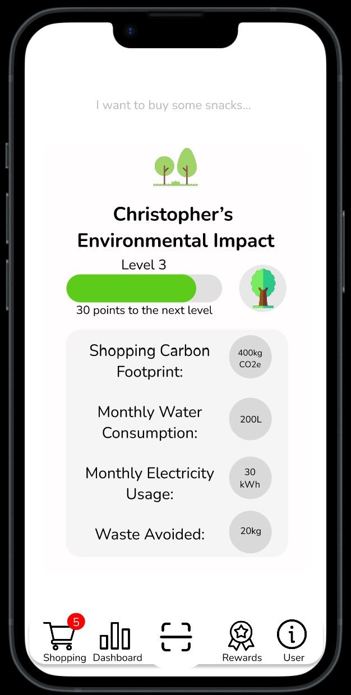

# Project Green Living: Sustainable Shopping Companion App

Finalist entry for DSTA BrainHack 2024 CODE_EXP: A sustainable shopping companion app aimed at integrating environmental awareness into the user's shopping experience, empowering users to make eco-friendly choices more effortlessly.

_This project won 1st runner-up in the Best Minimum Viable Product Category_

## Overview

This app utilises OpenAI Assistant API to provide users with recommended eco-friendly choices while shopping. It aims to enhance environmental consciousness by making sustainable options more accessible and convenient.

## Features

- **OpenAI Assistant API Integration:** Recommends eco-friendly products and choices based on user preferences.
- **AWS Cognito Authentication:** Handles secure user authentication and authorisation.
- **React Native Frontend:** Provides a responsive and intuitive mobile interface.

## Installation

To run the app locally:

1. Clone this repository.
2. Install dependencies with `npm install`.
3. Set up AWS Cognito configurations in the app.
4. Run the app with `npm start`.

## Contributing

Contributions are welcome! If you have suggestions, feature requests, or want to report issues, please open an issue or submit a pull request.
